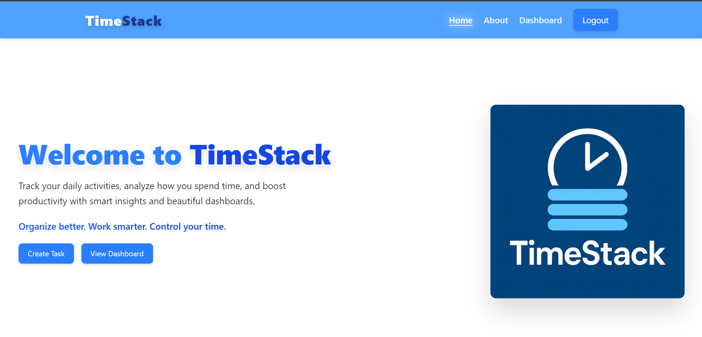
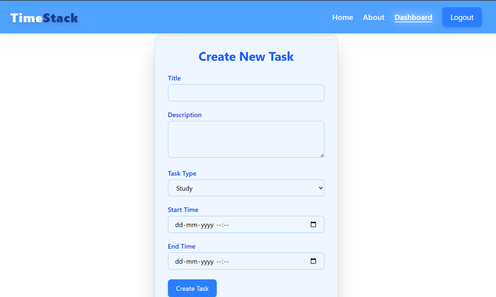
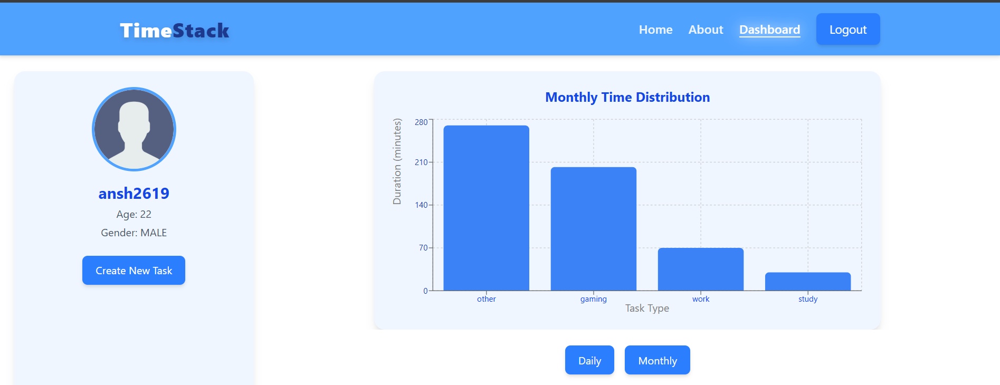
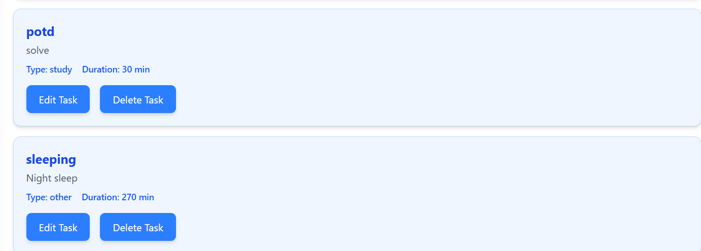

# ⏳ TimeStack

**TimeStack** is a modern, full-stack **time-tracking and productivity web application** that helps users **create, track, and analyze tasks** to improve daily efficiency — all through a clean and intuitive interface.

> 🚀 *Advanced features with AI-powered productivity suggestions coming soon.*

🌐 **Live Demo:**  
👉 https://clinquant-otter-ee944c.netlify.app/

---

## ✨ Overview

TimeStack is designed to give users a **clear and structured view of how they spend their time**.  
With an intuitive UI and a powerful backend, it enables efficient task tracking, insightful time visualization, and productivity analytics — all from a single dashboard.

---

## 🎯 Ideal For

- 🎓 **Students**
- 💻 **Developers**
- 🧑‍💼 **Professionals**
- ⏱️ **Anyone looking to optimize time usage**

---

## 📸 App Preview

### 🏠 Home Page

### ✏️ Task Creation

### 📊 Task Analytics

### 🗂️ Task Overview

---

## 🚀 Features

- ⏱️ Track time spent on tasks and activities  
- 📊 Visual dashboards for time analysis  
- 🗂️ Task creation, organization & management  
- 🔐 Secure authentication using JWT  
- 🎨 Clean, modern, and minimal UI  
- 📱 Fully responsive across all devices  
- ⚡ Fast and scalable full-stack architecture  
- 🌐 Frontend deployed on Netlify  

---

## 🛠 Tech Stack

### 🎨 Frontend
- **React.js**
- **Tailwind CSS**
- **Context API**

### ⚙️ Backend
- **Node.js**
- **Express.js**
- **MongoDB Atlas**
- **JWT Authentication**

---

## 🌱 Upcoming Features

- 🤖 AI-based task suggestions  
- 📈 Productivity insights & trends  
- 🔔 Smart reminders and alerts  

---

## 👨‍💻 Author

Built with ❤️ by **cyberhypex**

- GitHub: https://github.com/cyberhypex  
- Live App: https://clinquant-otter-ee944c.netlify.app/
